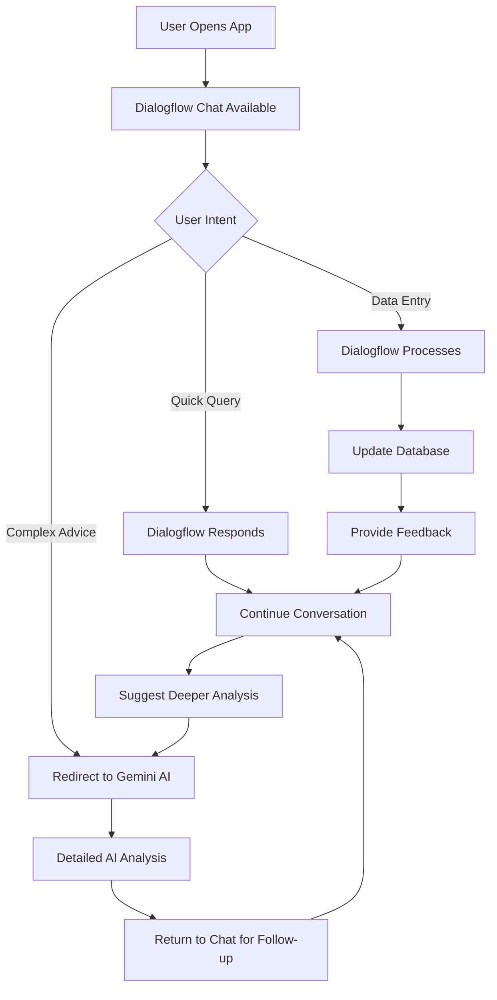

# 🤖 AI Integration Strategy: Dialogflow ES + Gemini AI

## Overview: Two AI Systems, One Powerful Experience

Your EcoCloudApp now has **two complementary AI systems** that work together to provide the ultimate user experience:

### 🎯 **Dialogflow ES Virtual Assistant** (New)
**Role**: Conversational Interface & Data Navigator
- **Quick Queries**: "What's my carbon footprint?"
- **Data Entry**: "I drove 25 km today"
- **App Navigation**: "Show my achievements"
- **Real-time Data**: Instant access to user's tracking data
- **Guided Discovery**: Helps users explore app features

### 🧠 **Gemini AI Suggestions** (Existing)
**Role**: Deep Environmental Consultant
- **Detailed Analysis**: Comprehensive environmental advice
- **Research-Based**: In-depth responses with statistics
- **Action Planning**: Structured action items with CO2 estimates
- **Educational**: Teaching users about environmental impact

## 🔄 **How They Complement Each Other**

### **1. User Journey Integration**

```
👤 User opens app
🤖 Dialogflow: "Hello! I can help you track your carbon footprint..."

👤 "What's my carbon footprint this month?"
🤖 Dialogflow: "Your total: 45.2 kg CO₂. Would you like detailed tips to reduce it?"

👤 "Yes, give me detailed tips"
🤖 Dialogflow: "I'll take you to our AI Suggestions section for comprehensive advice!"
[Redirects to Gemini AI Suggestions]

👤 [In Suggestions] "How can I reduce my transport emissions?"
🧠 Gemini: [Provides detailed 500-word analysis with action items]

👤 [Back to chat] "I want to track my progress"
🤖 Dialogflow: "Great! I'll help you log activities and monitor improvements"
```

### **2. Specialized Use Cases**

#### **Dialogflow ES Excels At:**
- ✅ **Quick Data Queries**: "Show my weekly emissions"
- ✅ **Data Entry**: "I used 15 kWh electricity"
- ✅ **Status Updates**: "How many green points do I have?"
- ✅ **App Navigation**: "Generate my report"
- ✅ **Real-time Feedback**: "You've earned 10 points!"
- ✅ **Conversational Flow**: Multi-turn conversations
- ✅ **Feature Discovery**: "What can I track?"

#### **Gemini AI Excels At:**
- 🧠 **Deep Analysis**: "Comprehensive home energy audit advice"
- 🧠 **Research-Based Answers**: Statistics, studies, detailed explanations
- 🧠 **Complex Planning**: Multi-step environmental strategies
- 🧠 **Educational Content**: Teaching environmental science
- 🧠 **Personalized Strategies**: Based on user's complete profile
- 🧠 **CO2 Calculations**: Precise reduction estimates
- 🧠 **Action Planning**: Structured implementation guides

### **3. User Experience Flow**



## 🎯 **Strategic Benefits**

### **1. Reduced Friction**
- **Before**: Users had to navigate to Suggestions page and formulate questions
- **After**: Instant access to help via chat icon anywhere in the app

### **2. Increased Engagement**
- **Dialogflow**: Encourages frequent, casual interactions
- **Gemini**: Provides deep, meaningful insights when needed

### **3. Better Data Quality**
- **Dialogflow**: Makes data entry conversational and intuitive
- **Gemini**: Helps users understand the impact of their data

### **4. Feature Discovery**
- **Dialogflow**: Guides users to discover app features naturally
- **Gemini**: Provides context for why features matter

## 💡 **Smart Integration Examples**

### **Example 1: Progressive Assistance**
```
👤 "How can I reduce my carbon footprint?"
🤖 Dialogflow: "I can give you quick tips, or connect you with our AI consultant for detailed analysis. What would you prefer?"

👤 "Quick tips first"
🤖 Dialogflow: "Based on your data: Focus on transport (60% of your emissions). Try biking twice a week!"

👤 "Tell me more about transport"
🤖 Dialogflow: "Let me connect you with our AI consultant for a comprehensive transport analysis..."
[Opens Gemini AI Suggestions with pre-filled query]
```

### **Example 2: Data-Driven Recommendations**
```
👤 "I drove 50 km today"
🤖 Dialogflow: "Added! That's 10.5 kg CO₂. You're at 45% of your monthly target."

👤 "Is that a lot?"
🤖 Dialogflow: "It's moderate. Would you like personalized strategies to reduce transport emissions?"
[Suggests Gemini AI consultation]
```

### **Example 3: Follow-up Actions**
```
[User gets detailed advice from Gemini AI]
🧠 Gemini: "Switch to electric vehicle could save 2,400 kg CO₂/year..."

[User returns to chat]
👤 "I'm interested in electric vehicles"
🤖 Dialogflow: "Great! I can help you track your research progress and calculate potential savings as you explore options."
```

## 🔧 **Technical Integration Points**

### **1. Cross-Referencing**
- Dialogflow can reference Gemini AI suggestions
- Gemini AI can suggest using Dialogflow for tracking

### **2. Data Sharing**
- Both systems access the same user carbon data
- Consistent recommendations across platforms

### **3. Context Preservation**
- Dialogflow maintains conversation context
- Can resume conversations after Gemini consultations

## 📊 **User Behavior Optimization**

### **New User Journey:**
1. **Discovery**: Dialogflow introduces app capabilities
2. **Quick Start**: Easy data entry via conversation
3. **Engagement**: Regular check-ins and encouragement
4. **Deep Dive**: Guided to Gemini AI for comprehensive advice
5. **Implementation**: Dialogflow helps track progress

### **Power User Journey:**
1. **Quick Updates**: "I biked to work today"
2. **Status Checks**: "How am I doing this month?"
3. **Strategic Planning**: Deep consultation with Gemini AI
4. **Progress Tracking**: Ongoing monitoring via Dialogflow

## 🎯 **Business Impact**

### **Increased User Engagement**
- **Daily Interactions**: Dialogflow encourages frequent use
- **Deep Engagement**: Gemini AI provides value for serious users

### **Better Data Collection**
- **Easier Entry**: Conversational interface reduces friction
- **More Complete**: Guided conversations encourage full data

### **Feature Adoption**
- **Discovery**: Dialogflow introduces features naturally
- **Education**: Gemini AI explains why features matter

### **User Retention**
- **Immediate Value**: Quick answers keep users engaged
- **Long-term Value**: Deep insights build loyalty

## 🚀 **Future Enhancements**

### **Phase 1: Smart Routing**
- Dialogflow automatically determines when to suggest Gemini AI
- Context-aware handoffs between systems

### **Phase 2: Unified Memory**
- Shared conversation history
- Seamless experience across both AI systems

### **Phase 3: Collaborative Intelligence**
- Dialogflow and Gemini AI work together on complex queries
- Real-time collaboration for optimal responses

## ✨ **The Perfect AI Ecosystem**

Your EcoCloudApp now offers:

🤖 **Immediate Assistance** (Dialogflow ES)
- Always available
- Quick responses
- Data integration
- Conversational flow

🧠 **Expert Consultation** (Gemini AI)
- Deep analysis
- Research-based advice
- Structured planning
- Educational content

Together, they create an unmatched user experience that serves both casual users seeking quick help and dedicated environmentalists wanting comprehensive guidance.

**Result**: Higher engagement, better data quality, increased feature adoption, and superior user satisfaction! 🌍✨
